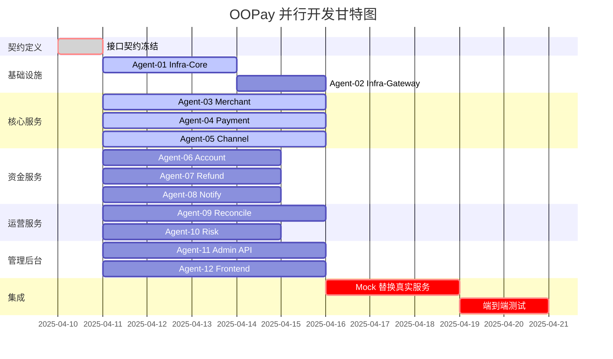

# OOPay 极致并行开发方案

> 核心思想：**接口契约先行 + Mock 实现解耦**，所有 Agent 同时开工，零阻塞等待

---

## 1. 并行策略重构

### 传统串行思维 ❌
```
Infra → Merchant → Payment → Account → Refund → ... (排队等待)
```

### 极致并行思维 ✅
```
                    ┌─────────────────────────────────────┐
                    │    Day 1: 接口契约冻结 (所有 Agent)   │
                    └─────────────────┬───────────────────┘
                                      │
        ┌─────────────────────────────┼─────────────────────────────┐
        │                             │                             │
        ▼                             ▼                             ▼
┌───────────────┐          ┌───────────────┐          ┌───────────────┐
│  Agent-Infra  │          │ Agent-Merchant│          │ Agent-Payment │
│  + 真实实现   │          │  + Mock 实现  │          │  + Mock 实现  │
└───────┬───────┘          └───────┬───────┘          └───────┬───────┘
        │                          │                          │
        │                          │     ┌────────────────────┘
        │                          │     │
        ▼                          ▼     ▼
  数据库脚本                  接口跑通 (Mock)
  工具类                      单元测试通过
  网关基础                    等待真实依赖
```

### 解耦核心：Mock 服务矩阵

| Agent | Mock 依赖项 | 契约定义 | 并行状态 |
|-------|------------|---------|---------|
| Agent-Merchant | 无 | 商户接口契约 | 🟢 可立即开工 |
| Agent-Payment | Merchant(查商户信息) | 支付接口契约 | 🟢 Mock 商户服务 |
| Agent-Account | Payment(入账触发) | 账户接口契约 | 🟢 Mock 支付回调 |
| Agent-Refund | Payment(查订单), Account(扣款) | 退款接口契约 | 🟢 Mock 双依赖 |
| Agent-Channel | 无 | 通道接口契约 | 🟢 可立即开工 |
| Agent-Notify | Payment, Refund | 通知接口契约 | 🟢 Mock 事件源 |
| Agent-Risk | Payment(下单拦截点) | 风控接口契约 | 🟢 Mock 支付接口 |
| Agent-Reconcile | Payment, Refund, Account | 对账接口契约 | 🟢 Mock 全依赖 |
| Agent-Admin | 所有服务 | 管理接口契约 | 🟢 Mock 全服务 |
| Agent-AdminUI | Admin API | 前端接口契约 | 🟢 Mock API |
| Agent-MerchantUI | Merchant API | 前端接口契约 | 🟢 Mock API |

---

## 2. 12 Agent 并行任务分配

### 🚀 Phase 0: 契约日 (Day 1，全员参与)
**目标**：冻结所有模块接口，定义 Mock 行为

```yaml
任务清单:
  - 定义所有服务的 interface (Java Interface)
  - 定义所有 DTO/Request/Response
  - 定义事件结构 (OrderPaidEvent/RefundSuccessEvent)
  - 编写 Mock 实现类 (返回固定数据)
  - 编写契约测试 (验证 Mock 符合契约)

产出物:
  - oopay-contract/ 模块 (纯接口 + DTO)
  - oopay-mock/ 模块 (Mock 实现)
```

---

### 📦 12 个并行 Agent 任务

#### Agent-01: Infra-Core (基础设施核心)
```yaml
优先级: P0 (阻塞最小)
任务:
  - 数据库 DDL 脚本 (12张表)
  - 通用工具类 (签名/加密/ID生成/金额)
  - 统一响应封装 (Result/PageResult)
  - 全局异常处理
  - 雪花算法 ID 生成器
  
交付标准:
  - sql/init/ 可执行
  - oopay-common/ 可被依赖
  
阻塞: 无
并行: 🟢 可与其他所有 Agent 同时开工
```

#### Agent-02: Infra-Gateway (网关基础)
```yaml
优先级: P1
任务:
  - Spring Cloud Gateway 脚手架
  - CORS 配置
  - 健康检查接口
  - 日志拦截器框架
  - 路由配置 (先指向 Mock 服务)
  
交付标准:
  - oopay-gateway/ 可启动
  - 路由到 Mock 服务正常
  
阻塞: Agent-01 (工具类)
并行: 🟡 等待 common 模块
```

#### Agent-03: Merchant-Service (商户服务)
```yaml
优先级: P0
任务:
  - Merchant 实体 + CRUD
  - 商户注册/入驻接口
  - 商户审核流程
  - API 密钥生成 (HMAC-SHA256)
  - IP 白名单配置
  
Mock 策略:
  - 无外部依赖，直接真实实现
  
交付标准:
  - oopay-merchant/ 可独立运行
  - 商户全生命周期接口可用
  
阻塞: 无 (依赖已冻结的 common)
并行: 🟢 可立即开工
```

#### Agent-04: Payment-Core (支付核心)
```yaml
优先级: P0
任务:
  - Order 实体 + 状态机
  - 统一下单接口 (幂等校验)
  - 订单查询接口
  - 订单关闭接口
  - 支付回调处理框架
  - 订单超时关闭任务
  
Mock 策略:
  - 商户验证: 调用 MockMerchantService (固定返回有效商户)
  - 通道调用: 调用 MockChannelService (固定返回成功)
  
交付标准:
  - 下单流程跑通 (Mock 数据)
  - 状态机流转正确
  
阻塞: 无 (Mock 解耦)
并行: 🟢 可立即开工
```

#### Agent-05: Channel-Manager (通道管理)
```yaml
优先级: P0
任务:
  - PayChannel 实体 + CRUD
  - 通道配置接口
  - 商户-通道绑定
  - 抽象支付接口定义
  - Mock 支付通道 (固定返回成功/失败)
  
Mock 策略:
  - 支付处理: Mock 实现返回固定结果
  
交付标准:
  - 通道 CRUD 完整
  - Mock 支付可返回结果
  
阻塞: 无
并行: 🟢 可立即开工
```

#### Agent-06: Account-Service (账户资金)
```yaml
优先级: P1
任务:
  - Account 实体 + 流水表
  - 开户接口
  - 余额查询
  - 资金冻结/解冻
  - 入账/出账逻辑
  
Mock 策略:
  - 入账触发: MockPaymentCallback (模拟支付成功)
  
交付标准:
  - 账户操作完整
  - 流水记录准确
  
阻塞: 无 (Mock 解耦)
并行: 🟢 可立即开工
```

#### Agent-07: Refund-Service (退款服务)
```yaml
优先级: P1
任务:
  - RefundOrder 实体
  - 退款申请接口
  - 退款审核流程
  - 原路退回逻辑
  
Mock 策略:
  - 订单查询: MockOrderService
  - 账户扣款: MockAccountService
  
交付标准:
  - 退款流程跑通
  
阻塞: 无 (Mock 解耦)
并行: 🟢 可立即开工
```

#### Agent-08: Notify-Service (通知服务)
```yaml
优先级: P1
任务:
  - NotifyRecord 实体
  - 异步通知发送
  - 重试机制 (1/2/4/8/16分钟)
  - 通知日志
  
Mock 策略:
  - 事件监听: MockEventPublisher
  
交付标准:
  - 通知可发送
  - 重试策略生效
  
阻塞: 无 (Mock 解耦)
并行: 🟢 可立即开工
```

#### Agent-09: Reconcile-Service (对账中心)
```yaml
优先级: P2
任务:
  - 对账任务表
  - 实时对账逻辑
  - 日终对账任务
  - 差异检测
  
Mock 策略:
  - 订单数据: MockOrderRepository
  - 退款数据: MockRefundRepository
  - 账户流水: MockAccountFlowRepository
  
交付标准:
  - 对账逻辑完整
  
阻塞: 无 (Mock 解耦)
并行: 🟢 可立即开工
```

#### Agent-10: Risk-Service (风控管理)
```yaml
优先级: P2
任务:
  - 风控规则表
  - 规则引擎框架
  - 支付前拦截
  - TG Bot 通知框架
  
Mock 策略:
  - 拦截点: MockPaymentInterceptor
  
交付标准:
  - 规则可配置
  - 拦截可触发
  
阻塞: 无 (Mock 解耦)
并行: 🟢 可立即开工
```

#### Agent-11: Admin-Backend (管理后台 API)
```yaml
优先级: P2
任务:
  - 汇总所有管理接口
  - 商户管理
  - 订单管理
  - 通道管理
  - 对账管理
  - 风控管理
  - Dashboard 统计
  
Mock 策略:
  - 所有服务: MockXXService
  
交付标准:
  - 管理接口完整
  
阻塞: 无 (Mock 解耦)
并行: 🟢 可立即开工
```

#### Agent-12: Frontend-All (前后端联调)
```yaml
优先级: P2
任务:
  - 管理后台前端 (Vue3)
  - 商户端前端 (Vue3)
  - 使用 Mock API 开发
  
Mock 策略:
  - Mock.js 拦截请求
  
交付标准:
  - 页面可交互
  
阻塞: 无 (Mock 解耦)
并行: 🟢 可立即开工
```

---

## 3. GitHub 甘特图管理方案

### 方案 A: GitHub Projects 看板 (推荐)

```yaml
设置步骤:
  1. 在 GitHub 仓库创建 Project (Board 视图)
  2. 设置列:
     - 📋 Todo (待开始)
     - 🏗️ In Progress (开发中)
     - 👀 Code Review (审查中)
     - ✅ Done (已完成)
     - 🔄 Integration (集成中)
  
  3. 创建 12 个 Issue，每个代表一个 Agent:
     - [Agent-01] Infra-Core
     - [Agent-02] Infra-Gateway
     - [Agent-03] Merchant-Service
     ...
  
  4. 设置自定义字段:
     - 进度百分比 (0-100)
     - 开始日期
     - 预计完成日期
     - 阻塞项
     - 实际完成日期
  
  5. 使用自动化:
     - PR 合并时自动移动卡片
     - 每日自动更新进度
```

### 方案 B: Markdown 甘特图 (mermaid)

```markdown

```

---

## 4. 每日同步机制

### 晨会 (15分钟，所有 Agent 参与)
```
格式:
1. [Agent-XX] 昨日完成: xxx
2. [Agent-XX] 今日计划: xxx
3. [Agent-XX] 阻塞: xxx (需要谁协助)
```

### GitHub Issue 模板

```markdown
## Agent-XX: [名称]

### 进度
- [ ] 0% 未开始
- [ ] 25% 进行中
- [ ] 50% 核心功能完成
- [ ] 75% 测试通过
- [ ] 100% 完成

### 今日完成
- [ ] 任务1
- [ ] 任务2

### 阻塞
- 依赖: [Agent-XX] 的 [接口名]

### 备注
```

---

## 5. 契约变更管理

### 冻结规则
```yaml
契约日 (Day 1):
  状态: 所有接口定义冻结
  变更: 禁止修改

开发期 (Day 2-N):
  变更流程:
    1. 发起变更申请 Issue
    2. 标记影响的所有 Agent
    3. 24小时内相关 Agent 确认
    4. 更新 Mock 实现
    5. 更新契约文档
```

---

## 6. 集成时间表

| 阶段 | 时间 | 动作 | 参与 Agent |
|------|------|------|-----------|
| 契约冻结 | Day 1 | 所有接口定义完成 | 全部 |
| Mock 自检 | Day 2 | 各 Agent 验证 Mock 可用 | 全部 |
| 真实替换 | Day 5-7 | 逐步替换 Mock 为真实服务 | 按依赖顺序 |
| 首次集成 | Day 7 | 商户入驻→下单→支付 全流程 | 03,04,05 |
| 完整集成 | Day 10 | 退款→对账→风控 全流程 | 全部 |
| 压力测试 | Day 12 | 1000 TPS 压测 | 全部 |

---

## 7. 风险与应对

| 风险 | 概率 | 影响 | 应对 |
|------|------|------|------|
| 契约频繁变更 | 中 | 高 | 变更审批制，24小时确认期 |
| Mock 与真实实现偏差 | 中 | 中 | 契约测试强制检查 |
| 集成时发现接口不匹配 | 低 | 高 | Day 2 Mock 自检，提前暴露 |
| 某个 Agent 延期 | 中 | 低 | Mock 兜底，不影响其他 Agent |

---

## 8. 总结：极致并行关键点

```
传统开发: 等待依赖 → 开发 → 集成
极致并行: 契约冻结 → 全部开工 → 逐步集成

关键成功因素:
1. Day 1 必须冻结所有接口
2. Mock 实现必须足够真实
3. 契约测试必须覆盖所有交互
4. 每日同步阻塞问题
5. 按时间表逐步替换 Mock
```

**理论并行度: 12 Agent 同时开工**  
**实际约束: Agent-01/02 需要先完成基础设施**
