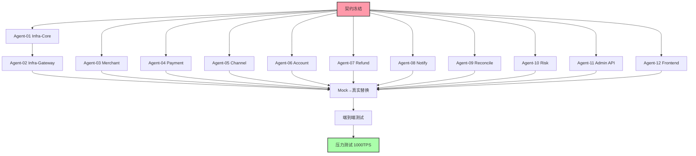
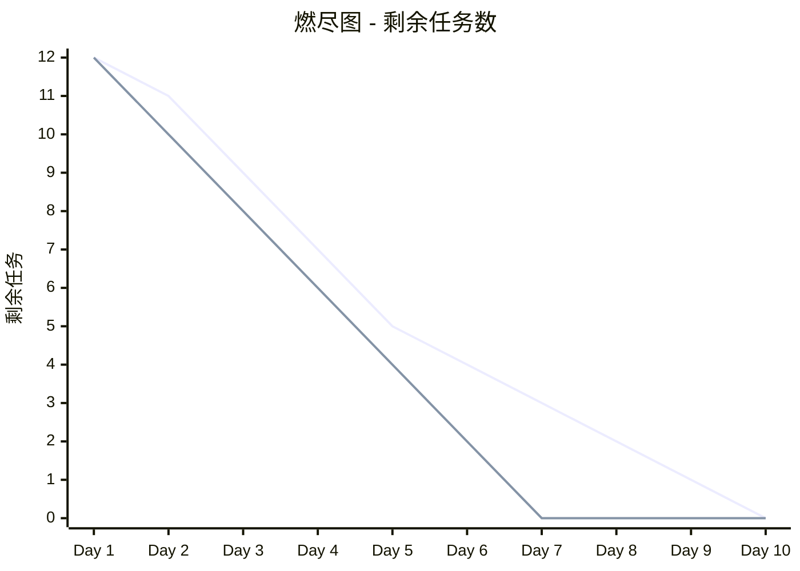

# OOPay 并行开发甘特图

> 使用 Mermaid 语法，GitHub 原生支持渲染

---

## 甘特图总览

```mermaid
gantt
    title OOPay 极致并行开发 - 甘特图
    dateFormat  YYYY-MM-DD
    axisFormat  %m/%d
    
    section 🔥 契约与准备
    接口契约冻结 (全员)     :crit, milestone, m1, 2025-04-11, 0d
    Mock 实现完成           :crit, mock, after m1, 1d
    
    section 🏗️ 基础设施 (2 Agent)
    Agent-01: Infra-Core    :active, a1, after m1, 3d
    Agent-02: Infra-Gateway :a2, after a1, 2d
    
    section 💳 核心服务 (3 Agent)
    Agent-03: Merchant      :active, a3, after m1, 5d
    Agent-04: Payment       :active, a4, after m1, 5d
    Agent-05: Channel       :active, a5, after m1, 5d
    
    section 💰 资金服务 (3 Agent)
    Agent-06: Account       :a6, after m1, 4d
    Agent-07: Refund        :a7, after m1, 4d
    Agent-08: Notify        :a8, after m1, 4d
    
    section 🛡️ 运营服务 (2 Agent)
    Agent-09: Reconcile     :a9, after m1, 5d
    Agent-10: Risk          :a10, after m1, 4d
    
    section 🖥️ 管理后台 (2 Agent)
    Agent-11: Admin API     :a11, after m1, 5d
    Agent-12: Frontend      :a12, after m1, 5d
    
    section 🔗 集成阶段
    Mock→真实服务替换       :crit, int1, after a1 a3 a4 a5, 3d
    端到端测试              :crit, int2, after int1, 2d
    压力测试 (1000TPS)      :crit, milestone, m2, after int2, 0d
```

---

## 关键里程碑

| 日期 | 里程碑 | 状态 |
|------|--------|------|
| 04-11 | 🎯 契约冻结 - 所有接口定义完成 | 🟡 计划中 |
| 04-12 | ✅ Mock 实现完成 - 可并行开发 | ⏳ 等待 |
| 04-16 | 🏗️ 基础设施完成 - 核心服务可集成 | ⏳ 等待 |
| 04-21 | 💳 核心服务完成 - 支付链路可用 | ⏳ 等待 |
| 04-23 | 💰 资金服务完成 - 退款可用 | ⏳ 等待 |
| 04-26 | 🔗 首次集成 - 商户→支付→回调 | ⏳ 等待 |
| 04-28 | ✅ 端到端测试通过 | ⏳ 等待 |
| 04-29 | 🚀 压力测试通过 (1000TPS) | ⏳ 等待 |

---

## Agent 并行进度矩阵

| Agent | 任务 | 开始 | 预计完成 | 进度 | 状态 | 阻塞 |
|-------|------|------|---------|------|------|------|
| Agent-01 | Infra-Core | 04-11 | 04-14 | 0% | ⏳ 等待契约 | 无 |
| Agent-02 | Infra-Gateway | 04-14 | 04-16 | 0% | ⏳ 等待 Agent-01 | Agent-01 |
| Agent-03 | Merchant | 04-11 | 04-16 | 0% | ⏳ 等待契约 | 无 |
| Agent-04 | Payment | 04-11 | 04-16 | 0% | ⏳ 等待契约 | 无 |
| Agent-05 | Channel | 04-11 | 04-16 | 0% | ⏳ 等待契约 | 无 |
| Agent-06 | Account | 04-11 | 04-15 | 0% | ⏳ 等待契约 | 无 |
| Agent-07 | Refund | 04-11 | 04-15 | 0% | ⏳ 等待契约 | 无 |
| Agent-08 | Notify | 04-11 | 04-15 | 0% | ⏳ 等待契约 | 无 |
| Agent-09 | Reconcile | 04-11 | 04-16 | 0% | ⏳ 等待契约 | 无 |
| Agent-10 | Risk | 04-11 | 04-15 | 0% | ⏳ 等待契约 | 无 |
| Agent-11 | Admin API | 04-11 | 04-16 | 0% | ⏳ 等待契约 | 无 |
| Agent-12 | Frontend | 04-11 | 04-16 | 0% | ⏳ 等待契约 | 无 |

---

## 依赖关系图



---

## 燃尽图 (Burndown Chart)



理想线: 每天完成 1.2 个 Agent  
实际线: 跟踪每日进度

---

## 每日进度更新模板

```markdown
## 日期: 2025-04-11

### 已完成 ✅
- [Agent-XX] 任务描述

### 进行中 🏗️
- [Agent-XX] 任务描述 (进度: 50%)

### 阻塞 ⚠️
- [Agent-XX] 等待 [Agent-YY] 的 [接口名]

### 明日计划 📋
- [Agent-XX] 计划完成的任务
```

---

## 如何更新此甘特图

1. **编辑本文件**: 直接修改 `GANTT_CHART.md`
2. **更新进度矩阵**: 修改 Agent 表格中的"进度"列
3. **更新里程碑**: 标记已完成的里程碑
4. **提交到 GitHub**: GitHub 会自动渲染 Mermaid 图表

---

*最后更新: 2025-04-11*  
*计划版本: v2.0 - 极致并行*
